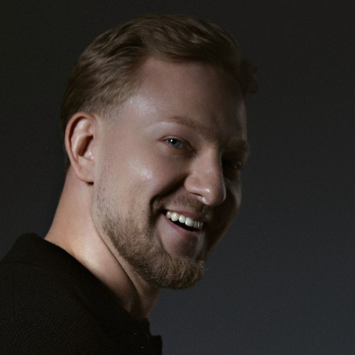

::: {.hero-block}

  <a href="https://t.me/Zzzabardast" aria-label="Telegram" title="Telegram: @Zzzabardast"><i class="bi bi-telegram"></i></a>
  <a href="mailto:y.azin@mail.ru" aria-label="Email" title="y.azin@mail.ru"><i class="bi bi-envelope"></i></a>

> Гораздо ценнее приблизительный ответ на правильный вопрос,
> чем точный — на неправильный.
>
> — Джон Тьюки

Привет! Я DS Team Lead с многогранным опытом. Прошёл путь от
классических алгоритмов машинного обучения до современных
NLP-решений. Заряжаюсь от сложных задач, новых знаний
и сильной команды вокруг. Подробнее обо мне [тут](about.qmd). Если повезёт,
нахожу время и пишу в [блог](blog.qmd) — с кодом или без,
иногда с опечатками. Извинити!

:::
